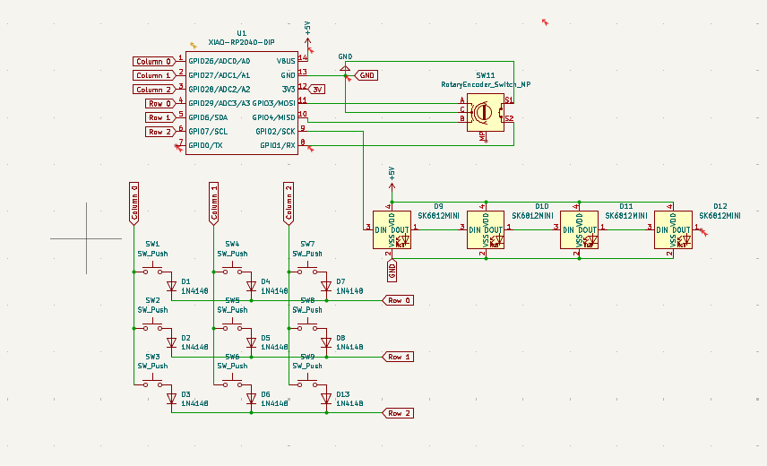
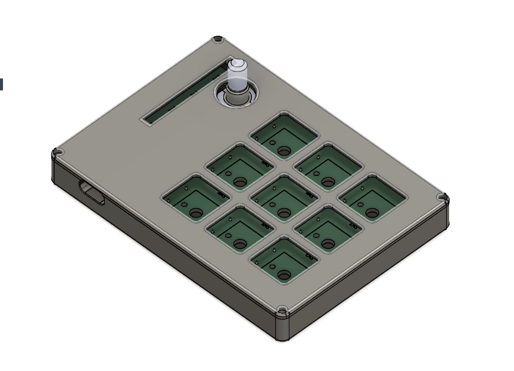

# Diaxx’s Macropad

Hi! This is my submission for Hackpad.  
It’s a small 9-key macropad built around the Seeed XIAO RP2040, with a rotary encoder and RGB lighting.  
I wanted it to be simple and aesthetic ^^

---

## Features
- 9× mechanical MX-style keys  
- 1x EC11 rotary encoder (with push button)  
- 4x SK6812 Mini-E RGB LEDs  
- Fully custom PCB designed in KiCad  
- 3D printed case made in Fusion 360  
- KMK firmware   
- Designed it for my own preferences ( shortcuts etc...) 

---

## PCB
The PCB was made entirely in KiCad.  
Clearance, net labels, and footprints follow the Hackpad guidelines, and everything passes DRC.

**PCB Layout:**  

**Schematic:**  

---

## CAD
The case is modeled in Fusion 360.  
It’s a two-part design (top + bottom) using M3 heat-set inserts and screws to hold everything together.

The full assembly is included as a `.STEP` file in the CAD folder.

---

## Firmware
The firmware uses **KMK**, running on CircuitPython.  
`main.py` handles:
- Key scanning  
- Rotary encoder events  
- Optional RGB LED animations  

All firmware files are in the `Firmware/` folder.

---

## Notes
I’m still new to KiCad and electronics, so making this board taught me a lot.  
Routing the encoder, footprints, and spacing everything correctly took some trial and error, but the final design came together nicely.

---

## BOM
- 1× Seeed XIAO RP2040  
- 8× MX-style switches  
- 8× 1N4148 diodes  
- 1× EC11 rotary encoder  
- 4× SK6812 Mini-E LEDs  
- 4× M3×16 screws  
- 4× M3 heat-set inserts  
- 3D printed case (top + bottom)

