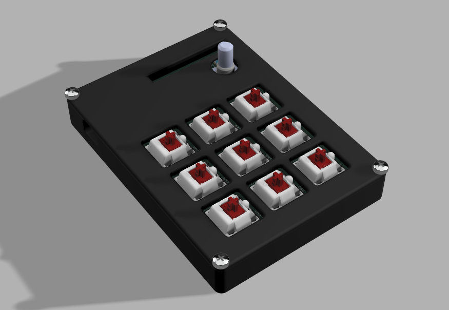
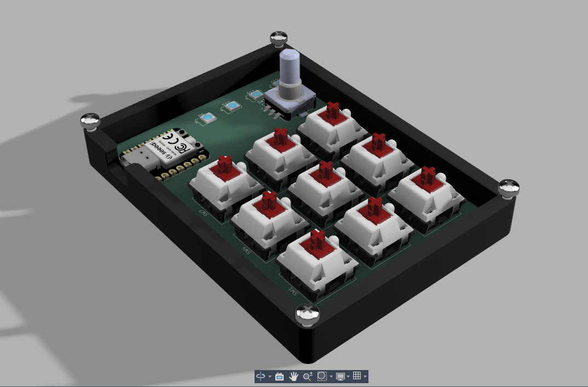
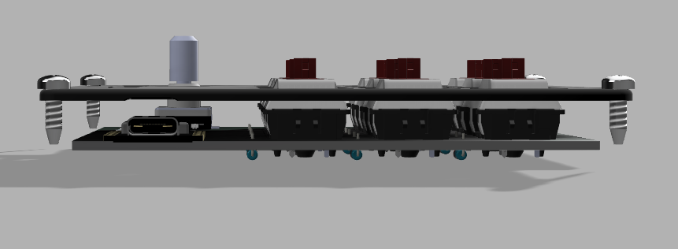

# Diaxx’s Macropad

Hi! This is my submission for Hackpad.  
It’s a small 9-key macropad built around the Seeed XIAO RP2040, with a rotary encoder and RGB lighting.  
I wanted it to be simple and aesthetic ^^

---

## Features
- mechanical MX-style keys  
- EC11 rotary encoder (with push button)  
- SK6812 Mini-E RGB LEDs  
- PCB designed in KiCad  
- 3D printed case made in Fusion 360  
- KMK firmware   
- Designed it for my own preferences ( shortcuts etc...) 

---

## PCB
The PCB was made entirely in KiCad. Everything passes DRC.  

**PCB Layout:**  

edit : Looking at it again, I can’t believe I actually made something like this.

**Schematic:**  

---

## CAD
The case is modeled in Fusion 360.  
It’s a two-part design (top + bottom) using m3 self insert screws to hold everything together. ( or hot glue... ) 

The full assembly is included as a `.STEP` file in the CAD folder.

---

## Firmware
The firmware uses **KMK**, running on CircuitPython.  
`main.py` handles:
- Key scanning  
- Rotary encoder events  
- Optional RGB LED animations  

All firmware files are in the `Firmware/` folder.

---

## Notes
I’m still new to KiCad and electronics, so making this board taught me a lot. 
Routing the traces, assigning footprints and spacing everything correctly took some trial and error, but the final design came together nicely and i learnt so much !!! 
also i want to thank hackclub because this is the first time someone gave me an opportunity in my life to do what i love .

---

## BOM
- 1× Seeed XIAO RP2040  
- 9× MX-style switches
- 9x Blank DSA Keycaps ( white please <3 ) 
- 9× 1N4148 diodes  
- 1× EC11 rotary encoder  +  Knob
- 4× SK6812 Mini-E LEDs  
- 4× M3 self-taping screws ( i will buy them myself since they are pretty cheap )   
- 3D printed case (top + bottom) both black so they could go with the white keycap.

